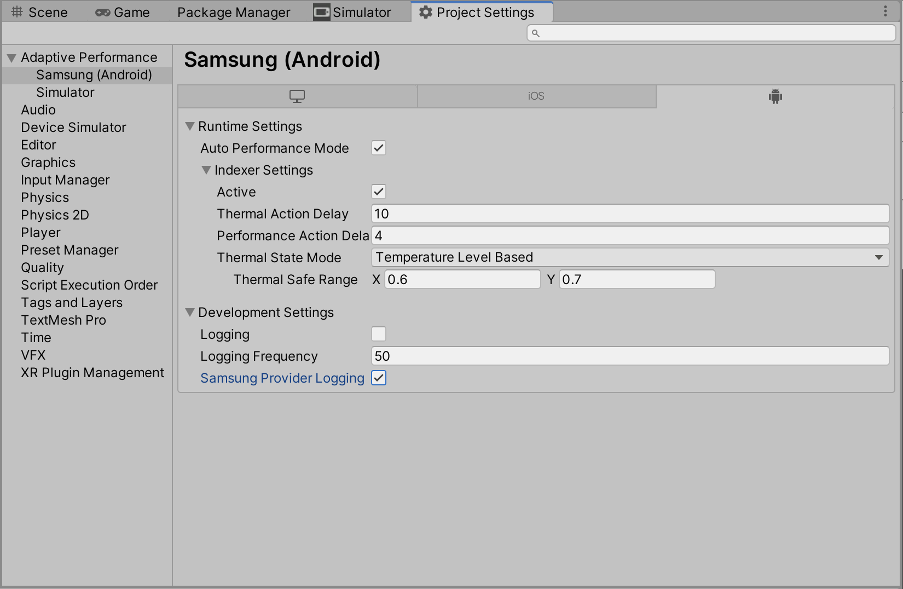

# User guide
## Requirements

* Make sure you install Android support for Unity. Unity needs Android support to build to your Samsung device. For more information, see [Adding modules to the Unity Editor](https://docs.unity3d.com/Manual/GettingStartedAddingEditorComponents.html).
* Switch the target build platform to Android in the [Build Settings](https://docs.unity3d.com/Manual/BuildSettings.html) window.
* Install and activate the **Adaptive Performance Samsung Android** provider in Adaptive Performance Settings.

When you build and deploy the app to your device, Adaptive Performance will be active by default.

**Note:** To enable Adaptive Performance log messages in development builds, enable the **Samsung Provider Logging** option in the **Project Settings &gt; Adaptive Performance &gt; Samsung (Android)** window. Adaptive Performance then starts printing status information to the console.

## Using the Adaptive Performance Samsung (Android) subsystem

This subsystem is only a data provider for Adaptive Performance and has no user-facing APIs, with the single exception of [Variable Refresh Rate APIs](vrr.md). The Adaptive Performance package includes all other functionality. For details, see the [Adaptive Performance](https://docs.unity3d.com/Packages/com.unity.adaptiveperformance@latest/index.html) documentation.
